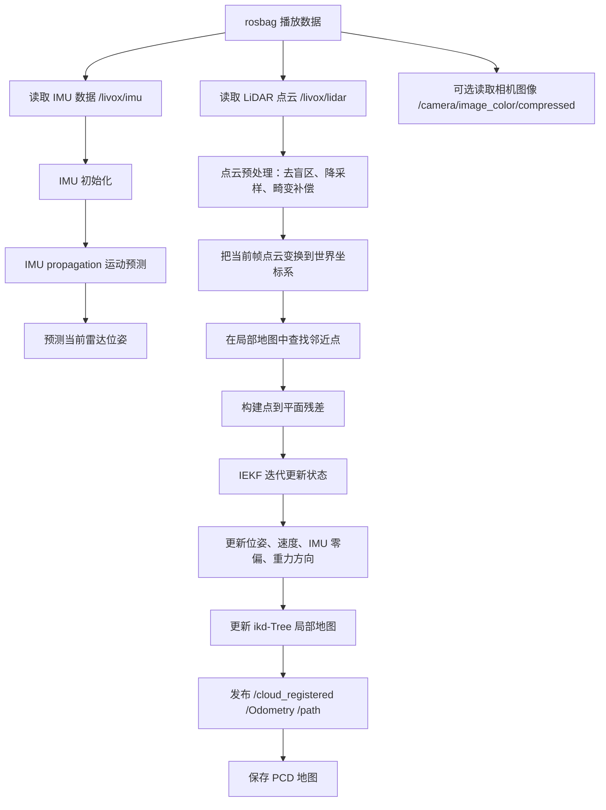
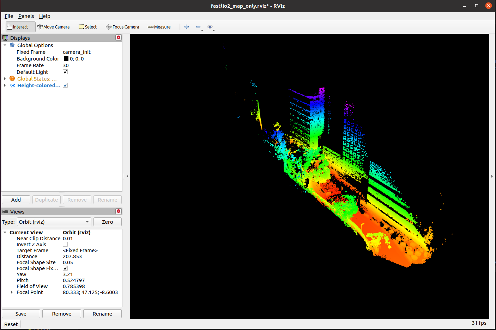
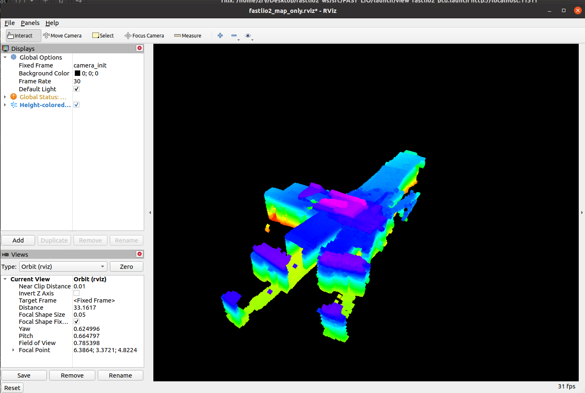
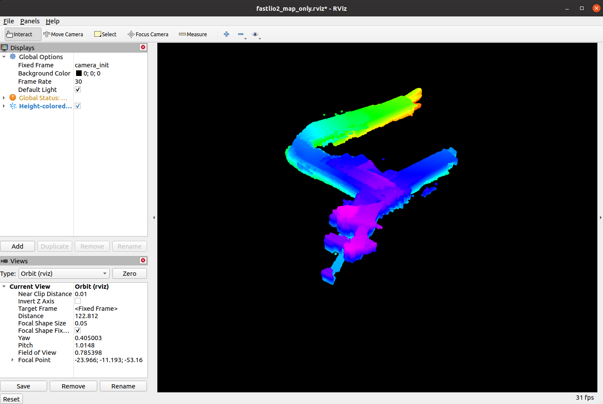

# FAST-LIO2 建图实验总结

本文档记录本项目中使用 ROS Noetic、FAST-LIO2 和 R3LIVE/HKU 数据包进行建图测试的过程、核心原理、建图结果对比以及后续调参思路。图片均使用相对路径引用，后续和项目一起上传 GitHub 时可以直接显示。

## 1. 项目目标

本项目的目标不是单纯跑通 FAST-LIO2，而是通过不同 bag 数据和不同参数组合，理解 FAST-LIO2 的完整建图流程，并学习如何判断建图效果、如何定位参数问题。

目前主要实验对象包括：

| 数据包 | 目标 | 状态 |
| --- | --- | --- |
| `degenerate_seq_02.bag` | 小场景、退化场景测试 | 已完成多组参数测试 |
| `hku_main_building.bag` | 主建筑大场景建图 | 因虚拟机内存不足，未能稳定完整建图 |
| `hku_park_01.bag` | 后续复杂室外场景测试 | 待继续实验 |

## 2. FAST-LIO2 总 Pipeline

FAST-LIO2 的主线可以理解为：用 IMU 高频预测运动，用 LiDAR 点云不断校正预测结果，最后把校正后的点云逐帧插入地图。



相机图像在 FAST-LIO2 中通常不参与优化，它更多是人观察场景的辅助窗口。比如看到相机画面中进入狭窄走廊、转弯、上坡、经过树木或玻璃墙时，可以对应检查 RViz 中点云是否漂移、变厚或断裂。

## 3. 核心状态量

FAST-LIO2 本质上是一个基于误差状态的迭代扩展卡尔曼滤波器。它估计的状态可以粗略写成：

$$
x =
\left[
R,\ p,\ v,\ b_g,\ b_a,\ g
\right]
$$

其中：

| 符号 | 含义 |
| --- | --- |
| $R$ | IMU/机体坐标系相对于世界坐标系的旋转姿态 |
| $p$ | IMU/机体在世界坐标系下的位置 |
| $v$ | IMU/机体在世界坐标系下的速度 |
| $b_g$ | 陀螺仪零偏 |
| $b_a$ | 加速度计零偏 |
| $g$ | 重力向量 |

这里的 IMU 通常由两个核心传感器组成：

| 传感器 | 测量内容 | 在 FAST-LIO2 中的作用 |
| --- | --- | --- |
| 陀螺仪 gyroscope | 角速度 | 用来积分姿态 |
| 加速度计 accelerometer | 加速度 | 用来积分速度和位置 |

## 4. IMU 预测模型

IMU 原始测量不是完美真值，而是带有零偏和噪声：

$$
\omega_m = \omega + b_g + n_g
$$

$$
a_m = a + b_a + n_a
$$

其中：

| 符号 | 含义 |
| --- | --- |
| $\omega_m$ | 陀螺仪测得的角速度 |
| $a_m$ | 加速度计测得的加速度 |
| $\omega$ | 真实角速度 |
| $a$ | 真实加速度 |
| $b_g$ | 陀螺仪零偏 |
| $b_a$ | 加速度计零偏 |
| $n_g$ | 陀螺仪白噪声 |
| $n_a$ | 加速度计白噪声 |

离散时间下，一个简单的一阶积分形式可以写成：

$$
R_{k+1} = R_k \mathrm{Exp}\left((\omega_m - b_g)\Delta t\right)
$$

$$
v_{k+1} = v_k + \left(R_k(a_m - b_a) + g\right)\Delta t
$$

$$
p_{k+1} = p_k + v_k\Delta t + \frac{1}{2}\left(R_k(a_m - b_a) + g\right)\Delta t^2
$$

直观理解：

1. 角速度积分得到姿态变化；
2. 加速度先扣除零偏，再从 IMU 坐标系旋转到世界坐标系；
3. 加上重力后积分得到速度；
4. 速度继续积分得到位置。

这一步只靠 IMU，会随着时间产生累计漂移，所以还需要 LiDAR 点云匹配来校正。

## 5. LiDAR 点云匹配模型

雷达点首先从 LiDAR 坐标系变换到 IMU 坐标系，再变换到世界坐标系：

$$
p_i^w = R_{WI}\left(R_{IL}p_i^L + t_{IL}\right) + t_{WI}
$$

其中：

| 符号 | 含义 |
| --- | --- |
| $p_i^L$ | 第 $i$ 个点在 LiDAR 坐标系下的位置 |
| $R_{IL}$ | LiDAR 到 IMU 的旋转外参 |
| $t_{IL}$ | LiDAR 到 IMU 的平移外参 |
| $R_{WI}$ | IMU 到世界坐标系的旋转 |
| $t_{WI}$ | IMU 到世界坐标系的平移 |
| $p_i^w$ | 该点变换到世界坐标系后的位置 |

FAST-LIO2 会在局部地图中寻找当前点附近的点，并拟合局部平面。点到平面的残差为：

$$
r_i = n_i^T(p_i^w - q_i)
$$

其中：

| 符号 | 含义 |
| --- | --- |
| $r_i$ | 第 $i$ 个点的点到平面残差 |
| $n_i$ | 局部平面的法向量 |
| $q_i$ | 局部平面上的一个参考点 |
| $p_i^w$ | 当前帧点云变换到世界坐标系后的点 |

如果位姿估计准确，当前帧点云应该贴合已有局部地图，残差 $r_i$ 应该较小。若残差持续偏大，常见表现就是墙体变厚、双层墙、地图撕裂、轨迹跳变。

## 6. IEKF 更新

普通卡尔曼滤波可以写成：

$$
P_k^- = F_kP_{k-1}F_k^T + Q_k
$$

$$
K_k = P_k^-H_k^T(H_kP_k^-H_k^T + R_k)^{-1}
$$

$$
\delta x = K_kr
$$

$$
\hat{x}_k = \hat{x}_k^- \boxplus \delta x
$$

$$
P_k = (I - K_kH_k)P_k^-
$$

其中：

| 符号 | 含义 | FAST-LIO2 中的直观对应 |
| --- | --- | --- |
| $P_k^-$ | 先验协方差 | 只经过 IMU 预测后的不确定性 |
| $F_k$ | 状态转移雅可比 | IMU 预测模型对状态误差的线性化 |
| $Q_k$ | 过程噪声协方差 | IMU 噪声、零偏随机游走，对应 `acc_cov`、`gyr_cov`、`b_acc_cov`、`b_gyr_cov` |
| $K_k$ | 卡尔曼增益 | 决定 LiDAR 残差对状态修正的影响大小 |
| $H_k$ | 观测雅可比 | 点到平面残差对状态误差的线性化 |
| $R_k$ | 观测噪声协方差 | 点云匹配残差的不确定性 |
| $r$ | 残差 | 当前点云和局部地图之间的点到平面误差 |
| $\boxplus$ | 流形上的状态更新 | 对旋转、位置、速度、零偏等状态进行误差注入 |

IEKF 的“迭代”体现在：同一帧 LiDAR 点云进入后，不是只更新一次，而是在当前线性化点附近多次重新计算残差和雅可比，让非线性的点云匹配问题更稳定。

## 7. 建图结果对比

### 7.1 实时 RViz 中的局部点云问题



这张图主要展示的是实时建图时的局部点云和轨迹，不是最终累计 PCD 地图。它的特点是：

1. RViz 中显示的是 `/cloud_registered` 或经过脚本降采样后的实时点云；
2. 如果只看见一坨绿色点云，通常说明显示的是当前局部帧或短时间窗口，而不是完整 PCD；
3. 相机窗口灰屏时，一般不是相机数据不存在，而是打开时机或 ROS topic 订阅不对，需要先确认：

```bash
rostopic hz /camera/image_color/compressed
rqt_image_view /camera/image_color/compressed
```

如果 `rostopic hz` 有频率，而 `rqt_image_view` 灰屏，优先重启 `rqt_image_view`，并在窗口上方重新选择 `/camera/image_color/compressed`。

### 7.2 Avia 参数结果



这张图的结构能看出一定建筑轮廓和轨迹形状，但整体存在明显问题：

1. 地图被拉成长条或分成几个相距较远的块，说明轨迹估计可能发生过漂移或跳变；
2. 高度颜色连续变化，但空间结构不够紧凑，说明某些时刻的位姿约束不够稳定；
3. 可能原因包括退化场景、IMU 噪声参数不匹配、盲区 `blind` 过大、视场角 `fov_degree` 或探测范围 `det_range` 不适合当前场景。

### 7.3 Mid360 参数测试结果



这张图看起来更像一个紧凑的建筑或平台结构，局部墙面和高度分层更清楚。但需要注意：

1. 如果 bag 实际采集设备是 Livox Avia，而配置文件换成 `mid360.yaml`，这不代表物理模型一定正确；
2. 它效果变好，可能不是因为雷达型号真的变了，而是因为 `mid360.yaml` 中某些参数更适合当前小场景，比如 `blind` 更小、`fov_degree` 更大、`det_range` 更保守；
3. 所以后续更推荐保留 Avia 的雷达类型和外参，再把有效参数迁移过去，例如调整 `blind`、`fov_degree`、`det_range`、`filter_size_surf`。

## 8. 主建筑数据没有完整建图成功的原因

`hku_main_building.bag` 是一个更大的长序列：

| 项目 | 说明 |
| --- | --- |
| bag 文件大小 | 约 7.9 GB |
| 运行时长 | 约 1170 秒 |
| 路径长度 | 约 1036 m |
| 场景 | 室内和室外混合 |

失败的主要原因不是算法一定不行，而是当前虚拟机资源不足：

1. 虚拟机内存约 5.8 GiB，对长序列累计建图偏小；
2. `/cloud_registered` 如果在 RViz 中无限累积显示，会快速吃掉显存和内存；
3. `pcd_save.interval: -1` 会把所有帧保存到一个 PCD 文件，长序列容易让内存压力持续上升；
4. 运行中出现过 `exit code -9`，这通常是进程被系统杀掉，常见原因就是内存不足；
5. 中途打开 RViz 并使用累计显示，会进一步加重压力，导致 Ubuntu 卡死或 VMware 无法正常重启虚拟机。

后续如果继续跑大场景，建议：

```yaml
pcd_save:
  pcd_save_en: true
  interval: 1000
```

或者先关闭 PCD 保存，只检查轨迹是否稳定：

```yaml
pcd_save:
  pcd_save_en: false
```

RViz 也不要显示无限累计的全量点云，优先显示降采样后的 topic，或者只在建图完成后再打开保存好的 PCD。

## 9. 调参和对比方法

### 9.1 不要只靠图片判断

最终 PCD 图片只能作为第一层判断。它能看出地图是否撕裂、墙是否变厚、结构是否明显，但不能完全证明算法精度。

更完整的对比应该包括：

1. 轨迹是否连续；
2. 是否有突然跳变；
3. 如果数据集有回到原点，起点和终点是否接近；
4. 墙面、地面、建筑边缘是否单层清晰；
5. 同一个场景不同参数下，点云厚度是否变薄；
6. 是否出现大面积飞点、斜墙、重影、重复楼层。

### 9.2 IMU 数据不等于真值

bag 里的 `/livox/imu` 是 IMU 测量值，不是真值。用 `rosbag record` 把它录下来，也只是重新录了一份传感器测量数据，不会变成 ground truth。

真正的真值通常来自：

1. RTK/GNSS；
2. motion capture 动捕系统；
3. 高精度全站仪；
4. 数据集官方提供的 ground truth；
5. 闭环场景中的起点终点误差，只能作为近似评价。

如果数据集没有官方真值，最实用的评价方法是：

$$
e_{loop} = \|p_{end} - p_{start}\|
$$

其中 $p_{start}$ 是起点位置，$p_{end}$ 是终点位置。只有当 bag 确实回到原点时，这个指标才有意义。

### 9.3 点云厚度判断

墙面或地面应该尽量像薄片。如果同一面墙变成厚厚一层，常见原因包括：

1. IMU 时间和 LiDAR 时间不同步；
2. 外参 `extrinsic_T` 或 `extrinsic_R` 不准确；
3. `acc_cov`、`gyr_cov` 过大或过小；
4. bag 播放速度过快导致处理跟不上；
5. 场景中动态物体太多；
6. 退化场景导致点云约束不足。

### 9.4 常用调参顺序

建议每次只改一到两个参数，并保存一份结果图和 PCD 文件，不要同时乱改很多参数。

推荐顺序：

1. 先确认 topic 正确：`/livox/lidar`、`/livox/imu`、`/camera/image_color/compressed`；
2. 确认雷达类型 `lidar_type` 和 bag 数据匹配；
3. 小场景先调 `blind`，例如从 `4` 改到 `0.5`；
4. 再调 `fov_degree`，例如从 `90` 改到 `180`；
5. 再调 `det_range`，大范围不一定更好，小场景可先用 `100`；
6. 如果点云太稀或太密，再调 `filter_size_surf` 和 `filter_size_map`；
7. 如果轨迹抖动、跳变、地图发散，再尝试微调 `acc_cov`、`gyr_cov`、`b_acc_cov`、`b_gyr_cov`；
8. 外参未知时不要轻易开启 `extrinsic_est_en`，它可能让结果更不稳定。

### 9.5 当前建议保留的一组 Avia 小场景参数方向

```yaml
preprocess:
  lidar_type: 1
  scan_line: 6
  blind: 0.5

mapping:
  acc_cov: 0.1
  gyr_cov: 0.1
  b_acc_cov: 0.0001
  b_gyr_cov: 0.0001
  fov_degree: 180
  det_range: 100.0
  extrinsic_est_en: false
```

这组参数更适合先做小场景验证。等小场景能稳定成图后，再扩展到更长、更复杂的数据。

## 10. 常用命令记录

进入工作空间：

```bash
cd ~/Desktop/fastlio2_ws
source devel/setup.bash
```

检查话题：

```bash
rostopic list
rostopic hz /livox/lidar
rostopic hz /livox/imu
rostopic hz /cloud_registered
rostopic hz /camera/image_color/compressed
```

播放 bag：

```bash
rosbag play bags/r3live/degenerate_seq_02.bag -r 1.0
```

打开相机：

```bash
rqt_image_view /camera/image_color/compressed
```

打开实时 RViz：

```bash
rviz -d ~/Desktop/fastlio2_ws/src/FAST_LIO/rviz_cfg/fastlio2_live_accumulate.rviz
```

查看保存好的 PCD：

```bash
roslaunch fast_lio view_fastlio2_pcd.launch \
  pcd:=/home/zfy/Desktop/fastlio2_ws/src/FAST_LIO/PCD/scans_avia_tuned_accumulate.pcd \
  stride:=2
```

大场景低内存建议：

```bash
rosbag play bags/r3live/hku_main_building.bag -r 1.0
```

大场景不要一开始就开无限累计 RViz，也不要默认把所有帧保存成一个超大 PCD。先用较低风险参数确认轨迹不发散，再决定是否分段保存。

## 11. 当前结论

1. FAST-LIO2 已经能在小场景上跑通完整流程；
2. 单纯看 PCD 图片不够，后续要结合轨迹、闭环误差、点云厚度、相机画面和 topic 频率一起判断；
3. `/livox/imu` 不是真值，rosbag 录下来也不是真值；
4. 主建筑大图失败主要是设备内存不足和全量累计显示/保存压力过大；
5. 后续最稳的路线是先把小场景 Avia 参数调稳定，再迁移到 park 或 main building 这种更复杂的数据。
