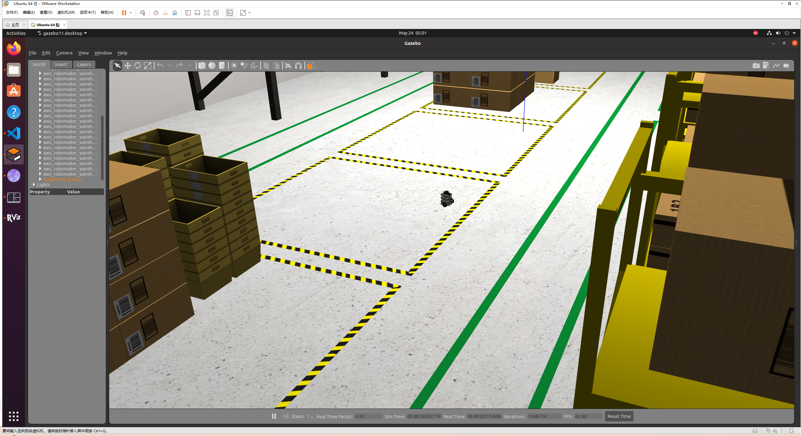
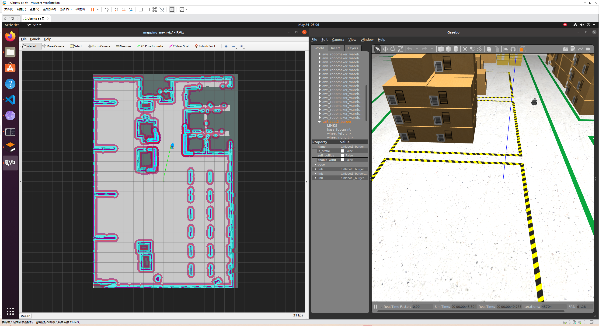
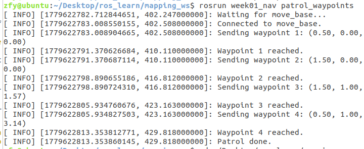
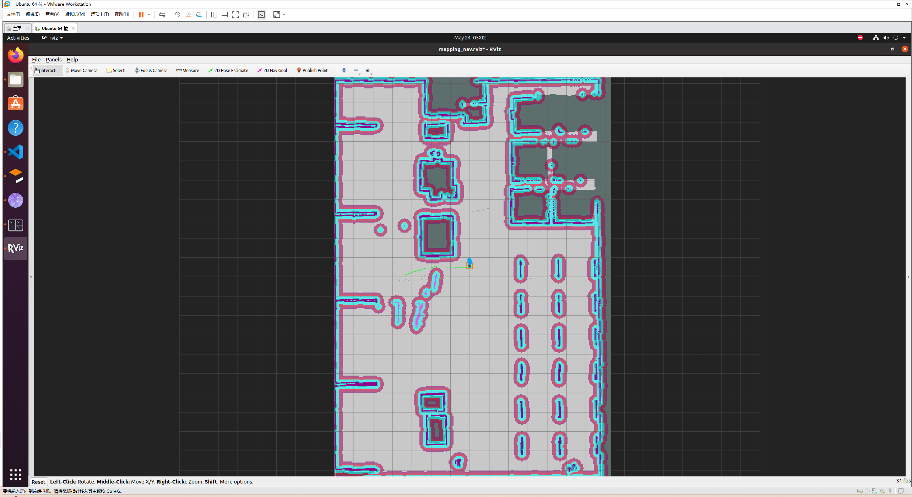
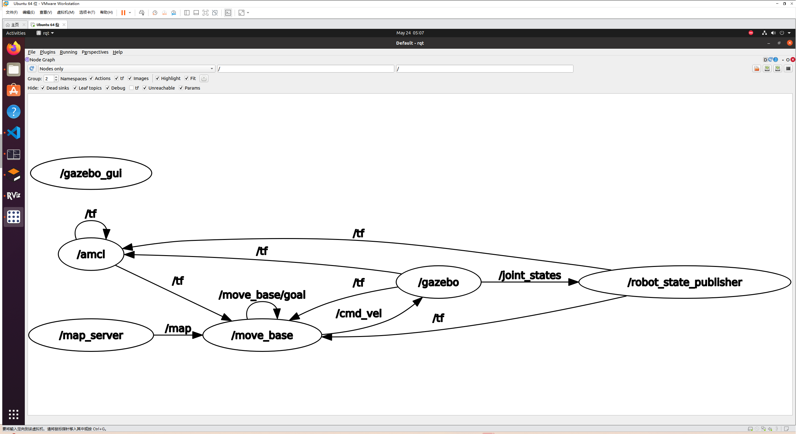
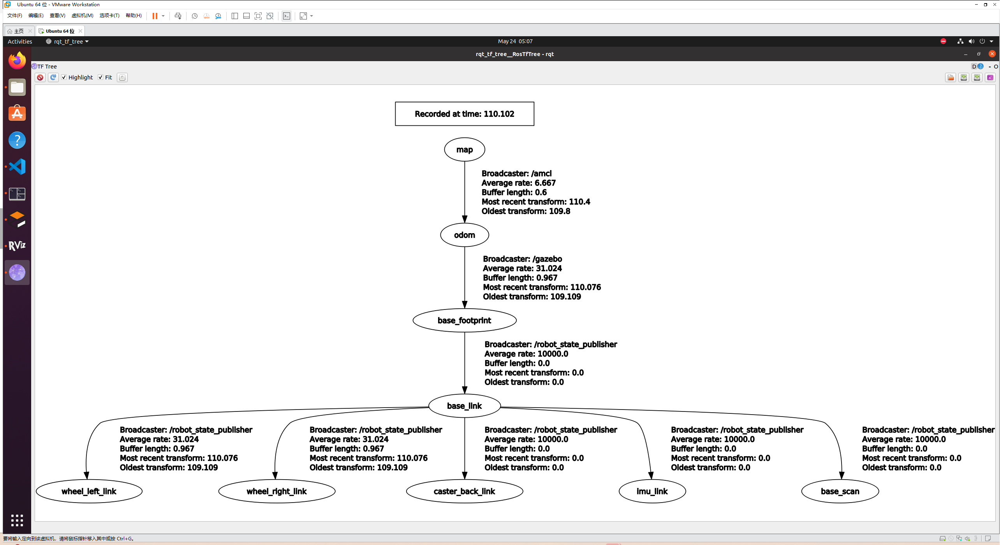

# Week01：ROS 仓库建图与导航项目

## 项目简介

本项目基于 ROS Noetic、Gazebo、TurtleBot3、gmapping、AMCL 和 move_base，实现仓库场景中的二维建图、静态地图导航、代价地图显示、目标点导航和多点巡航。

Ubuntu 工作空间路径：

```bash
~/Desktop/ros_learn/mapping_ws
```

核心功能包：

```bash
src/week01_nav
```

仿真世界包：

```bash
src/aws-robomaker-small-warehouse-world
```

## 运行环境

- Ubuntu 20.04
- ROS Noetic
- Gazebo
- TurtleBot3
- gmapping
- map_server
- amcl
- move_base
- RViz

编译前建议先设置 TurtleBot3 模型：

```bash
export TURTLEBOT3_MODEL=burger
```

如果想永久生效，可以写入 `~/.bashrc`：

```bash
echo "export TURTLEBOT3_MODEL=burger" >> ~/.bashrc
source ~/.bashrc
```

## 项目目录

```text
mapping_ws
├── build
├── devel
└── src
    ├── aws-robomaker-small-warehouse-world
    │   ├── launch
    │   ├── maps
    │   ├── models
    │   └── worlds
    └── week01_nav
        ├── config
        ├── launch
        ├── maps
        ├── rviz
        ├── scripts
        ├── src
        ├── CMakeLists.txt
        └── package.xml
```

## 效果截图

图片请放到本目录的 `images` 文件夹下。下面这些文件名已经预留好，上传 GitHub 后可以直接显示。

### 1. Gazebo 仓库场景



### 2. move_base 目标点导航



### 3. 多点自动巡航



### 4. 膨胀地图和局部代价地图



### 8. rqt_graph 计算图



### 9. TF 坐标树



## 主要文件说明

| 文件 | 作用 |
| --- | --- |
| `launch/warehouse_with_tb3.launch` | 启动 AWS 小仓库 Gazebo 世界，并生成 TurtleBot3 burger |
| `launch/gmapping_bringup.launch` | 启动 `slam_gmapping`，根据 `/scan`、里程计和 TF 生成 `/map` |
| `launch/mapping_full_stack.launch` | 一键启动建图流程：Gazebo、TurtleBot3、gmapping、RViz、可选键盘遥控 |
| `launch/nav_bringup.launch` | 一键启动导航流程：map_server、AMCL、move_base、RViz |
| `config/amcl.yaml` | AMCL 定位参数 |
| `config/costmap_common.yaml` | 全局/局部代价地图共用参数，包括 footprint、膨胀半径和激光障碍物来源 |
| `config/global_costmap.yaml` | 全局代价地图参数 |
| `config/local_costmap.yaml` | 局部代价地图参数 |
| `config/base_local_planner.yaml` | 局部轨迹规划器速度、加速度和目标容差参数 |
| `maps/aws_warehouse_map.yaml` | 默认静态地图配置 |
| `rviz/mapping_nav.rviz` | RViz 可视化配置，包含地图、激光、粒子云、路径、代价地图 |
| `src/single_goal_cli.cpp` | 命令行发送单个导航目标 |
| `src/patrol_waypoints.cpp` | 按预设航点自动巡航 |

## 编译

```bash
cd ~/Desktop/ros_learn/mapping_ws
source /opt/ros/noetic/setup.bash
catkin_make
source devel/setup.bash
```

## 启动方案一：只启动仓库世界和机器人

```bash
cd ~/Desktop/ros_learn/mapping_ws
source /opt/ros/noetic/setup.bash
source devel/setup.bash
roslaunch week01_nav warehouse_with_tb3.launch
```

用途：

- 检查 Gazebo 仓库世界是否正常加载
- 检查 TurtleBot3 是否正常生成
- 检查机器人模型、TF 和 `/scan` 是否正常

## 启动方案二：完整建图

```bash
cd ~/Desktop/ros_learn/mapping_ws
source /opt/ros/noetic/setup.bash
source devel/setup.bash
roslaunch week01_nav mapping_full_stack.launch use_teleop:=true
```

运行后：

- Gazebo 打开仓库场景
- TurtleBot3 在仓库中生成
- gmapping 发布 `/map`
- RViz 显示地图、激光、TF
- 可通过键盘遥控机器人移动，逐步扫完整张地图

保存地图：

```bash
cd ~/Desktop/ros_learn/mapping_ws
source devel/setup.bash
rosrun map_server map_saver -f src/week01_nav/maps/aws_warehouse_map
```

生成文件：

```text
src/week01_nav/maps/aws_warehouse_map.pgm
src/week01_nav/maps/aws_warehouse_map.yaml
```

## 启动方案三：使用默认静态地图导航

第一个终端启动 Gazebo 和机器人：

```bash
cd ~/Desktop/ros_learn/mapping_ws
source /opt/ros/noetic/setup.bash
source devel/setup.bash
roslaunch week01_nav warehouse_with_tb3.launch
```

第二个终端启动导航：

```bash
cd ~/Desktop/ros_learn/mapping_ws
source /opt/ros/noetic/setup.bash
source devel/setup.bash
roslaunch week01_nav nav_bringup.launch
```

RViz 操作顺序：

1. 使用 `2D Pose Estimate` 设置机器人初始位姿。
2. 初始位姿要和 Gazebo 中机器人真实位置尽量一致。
3. 等待 AMCL 粒子云收敛。
4. 使用 `2D Nav Goal` 发送导航目标。
5. 观察全局路径、局部路径、全局代价地图和局部代价地图。

## 启动方案四：使用 005 静态地图导航

如果要使用 `aws-robomaker-small-warehouse-world/maps/005` 中的静态地图，可以启动导航时指定 `map_file`：

```bash
cd ~/Desktop/ros_learn/mapping_ws
source /opt/ros/noetic/setup.bash
source devel/setup.bash
roslaunch week01_nav nav_bringup.launch map_file:=$(rospack find aws_robomaker_small_warehouse_world)/maps/005/map.yaml
```

也可以把 `launch/nav_bringup.launch` 中的默认地图改为：

```xml
<arg name="map_file" default="$(find aws_robomaker_small_warehouse_world)/maps/005/map.yaml"/>
```

注意：`005/map.yaml` 中引用的是同目录下的图片文件，不能只复制 yaml，必须保证图片也在同一目录。

## 启动方案五：命令行发送单目标

先启动导航：

```bash
roslaunch week01_nav nav_bringup.launch
```

再新开终端发送目标：

```bash
cd ~/Desktop/ros_learn/mapping_ws
source /opt/ros/noetic/setup.bash
source devel/setup.bash
rosrun week01_nav single_goal_cli 1.0 0.5 1.57
```

参数含义：

```text
1.0：目标 x 坐标
0.5：目标 y 坐标
1.57：目标朝向 yaw，单位是弧度
```

## 启动方案六：多点自动巡航

先启动导航：

```bash
roslaunch week01_nav nav_bringup.launch
```

再新开终端运行巡航节点：

```bash
cd ~/Desktop/ros_learn/mapping_ws
source /opt/ros/noetic/setup.bash
source devel/setup.bash
rosrun week01_nav patrol_waypoints
```

巡航点写在：

```text
src/week01_nav/src/patrol_waypoints.cpp
```

如果更换地图，需要把巡航点改到地图中的可通行区域。

## 查看膨胀地图和局部代价地图

本项目的 `rviz/mapping_nav.rviz` 已经预配置以下显示项：

```text
/map
/scan
/particlecloud
/move_base/global_costmap/costmap
/move_base/local_costmap/costmap
/move_base/NavfnROS/plan
/move_base/TrajectoryPlannerROS/local_plan
/move_base/local_costmap/footprint
RobotModel
TF
```

如果 RViz 中没有显示，可以手动添加：

```text
Add -> By topic -> /move_base/global_costmap/costmap
Add -> By topic -> /move_base/local_costmap/costmap
Add -> By topic -> /move_base/local_costmap/footprint
```

含义：

- `global_costmap`：全局代价地图，用于整张地图范围的路径规划。
- `local_costmap`：局部代价地图，是机器人周围滚动的小窗口。
- `inflation_radius`：障碍物膨胀半径，配置在 `config/costmap_common.yaml`。
- `footprint`：机器人在代价地图中的外形轮廓。

## rqt_graph 和 TF 树

打开 ROS 计算图：

```bash
rqt_graph
```

打开 rqt 总界面：

```bash
rqt
```

菜单路径：

```text
Plugins -> Introspection -> Node Graph
```

查看 TF 树：

```bash
rosrun rqt_tf_tree rqt_tf_tree
```

生成 TF 树 PDF：

```bash
rosrun tf view_frames
evince frames.pdf
```

## 常用检查命令

查看节点：

```bash
rosnode list
```

查看话题：

```bash
rostopic list
```

查看激光：

```bash
rostopic echo /scan
```

查看地图：

```bash
rostopic echo /map
```

查看 move_base 状态：

```bash
rostopic echo /move_base/status
```

查看 TF 是否连通：

```bash
rosrun tf tf_echo map base_link
```

## 建图流程

```text
Gazebo 仓库世界
        ↓
TurtleBot3 发布 /scan、/odom 和 TF
        ↓
gmapping 订阅 /scan + /odom + TF
        ↓
生成 /map
        ↓
map_saver 保存 pgm/yaml 静态地图
```

## 导航流程

```text
map_server 加载静态地图
        ↓
AMCL 根据 /scan 和地图估计机器人位姿
        ↓
move_base 接收目标点
        ↓
global_costmap 生成全局代价地图
        ↓
local_costmap 生成局部避障窗口
        ↓
局部规划器输出 /cmd_vel
        ↓
机器人在 Gazebo 中运动到目标点
```

